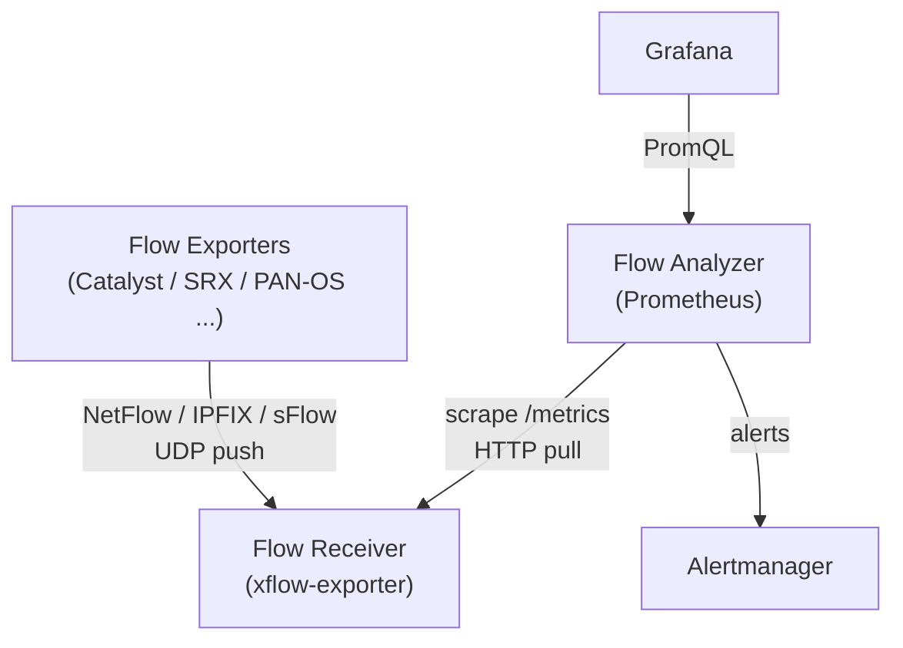

<div align="center">

  <picture>
    <source media="(prefers-color-scheme: dark)" srcset="./docs/assets/logo_dark.png" width="180px" />
    <source media="(prefers-color-scheme: light)" srcset="./docs/assets/logo.png" width="180px" />
    
  </picture>

  <h1>xflow-exporter</h1>

  <p>A Prometheus Exporter for traffic flows: NetFlow, IPFIX and sFlow.</p>

</div>

## Overview

This exporter receives flow records from on-premises network devices and serves aggregated Prometheus metrics.

- 📥 **Push-to-Pull Bridge**: Receives UDP flow exports and serves them to Prometheus scrapes
- 🧮 **In-Memory Aggregation**: Bounded-cardinality tables with Top-K and idle eviction
- 📊 **Native Histograms**: Flow size and duration quantiles within five percent, no buckets to choose
- 🔬 **Auditable Sampling**: Counts scaled by the rate in force, and that rate published beside them

> [!IMPORTANT]
> This project is pre-1.0: a minor release may rename or remove a metric. Read the [CHANGELOG](CHANGELOG.md) before upgrading.

## Architecture

Devices push flow datagrams into the exporter, and Prometheus pulls aggregates out of it.



A scrape reads the in-memory aggregation tables and never waits on flow arrival.

## Quick Start

### 1. Point your devices at the exporter

Configure each device to export flows to the exporter's address, UDP port 2055 by default. Every listener accepts every supported protocol, identified per datagram.

### 2. Run the exporter with Docker

```bash
docker run -p 10052:10052 -p 2055:2055/udp \
  ghcr.io/umatare5/xflow-exporter:latest \
  --collector.exporters --collector.hosts
```

> [!Tip]
> If you prefer using binaries, download them from the [release page](https://github.com/umatare5/xflow-exporter/releases).
>
> Supported Platforms are: `linux_amd64`, `linux_arm64`, `darwin_amd64`, `darwin_arm64` and `windows_amd64`

### 3. Scrape it

See [Prometheus Configuration](#prometheus-configuration) for the job and the alerting rules.

## Protocol Support

NetFlow v5/v8/v9, NetFlow-Lite, IPFIX and sFlow v5, over plaintext UDP. See [docs/protocols.md](docs/protocols.md) for per-protocol behaviour and limits.

## Syntax

`xflow-exporter --help` prints every flag, and [docs/configuration.md](docs/configuration.md) carries the same list.

Each data collector is enabled per module:

| Module                      | Publishes                                          |
| :-------------------------- | :------------------------------------------------- |
| `--collector.exporters`     | Per-device traffic by `exporter` and `version`     |
| `--collector.hosts`         | Traffic per source-destination address pair        |
| `--collector.services`      | Traffic per address pair, protocol and port        |
| `--collector.destinations`  | Traffic per destination address, protocol and port |
| `--collector.tcp-flags`     | Traffic per TCP control-bit profile                |
| `--collector.dscp`          | Traffic per DSCP class from the exported TOS byte  |
| `--collector.asns`          | Traffic per AS pair from device-exported numbers   |
| `--collector.applications`  | Traffic per AVC / App-ID / applicationId name      |
| `--collector.countries`     | Traffic per country pair from a country database   |
| `--collector.threats`       | Traffic per flagged address, needs a list file     |
| `--collector.distributions` | Flow size and duration native histograms           |

Optional enrichment fills dimensions a device did not export, each off by default: `--enrich.services` names an application from its port, and `--enrich.asn-database`, `--enrich.country-database` and `--enrich.threat-file` read files held locally. See [Enrichment](docs/README.md#enrichment).

`--remote-write.url` ships the registry where a scrape cannot reach, and the receive path is bounded under `--receiver.*`, `--parser.*` and `--aggregation.*`. See [Remote write](docs/README.md#remote-write) and [Push and pull](docs/README.md#push-and-pull).

## Endpoints

The exporter serves four endpoints:

- `/` — landing page, which confirms the exporter is running when reached at <http://localhost:10052/>
- `/metrics` — metrics endpoint, configurable via `--web.telemetry-path`
- `/healthz` — liveness probe, which returns a static 200 and deliberately ignores flow reception
- `/-/reload` — re-reads the enrichment sources on POST or PUT, exposed only with `--web.enable-lifecycle`. A `SIGHUP` does the same without the flag

## Metrics

This exporter aggregates flows into eleven modules. The ten table families, their metrics and their labels are documented in [docs/collectors.md](docs/collectors.md), and `distributions` publishes `xflow_flow_bytes` and `xflow_flow_duration_seconds` as native histograms.

See [docs/README.md](docs/README.md) for the absence, folding, eviction and sampling-correction semantics every module shares.

> [!Important]
>
> All collector modules are **disabled by default** to bound cardinality, and `distributions` needs Prometheus v3.8+ with native histogram ingestion enabled in the scrape configuration.

### Exporter Health Metrics

These series describe the exporter itself. They have no module and no collector flag. The aggregation series appear only while a collector module is enabled; the enrichment, threat and remote-write series only while their `--enrich.*` source or `--remote-write.url` is set.

| Metric                                              | Type    | Description                                          |
| :-------------------------------------------------- | :------ | :--------------------------------------------------- |
| `xflow_build_info`                                  | Gauge   | Exporter version in the `version` label, always 1    |
| `xflow_receiver_packets_total`                      | Counter | Datagrams read per `listener`, drops included        |
| `xflow_receiver_bytes_total`                        | Counter | Payload bytes received per `listener`                |
| `xflow_receiver_read_errors_total`                  | Counter | Socket read failures per `listener`                  |
| `xflow_receiver_dropped_packets_total`              | Counter | Pre-decode drops per `listener` and `reason`         |
| `xflow_receiver_queue_length`                       | Gauge   | Datagrams queued ahead of the decoders               |
| `xflow_receiver_queue_capacity`                     | Gauge   | Bound of that queue                                  |
| `xflow_flows_total`                                 | Counter | Records decoded per `exporter` and `version`         |
| `xflow_decode_errors_total`                         | Counter | Rejections per `exporter`, `version` and `reason`    |
| `xflow_last_flow_timestamp_seconds`                 | Gauge   | Unix time of the exporter's last decode              |
| `xflow_templates`                                   | Gauge   | Unexpired templates per domain and `type`            |
| `xflow_sequence_missed_total`                       | Counter | Export packets lost per domain                       |
| `xflow_sampling_rate`                               | Gauge   | Declared rate per domain, absent until one arrives   |
| `xflow_domains_refused_total`                       | Counter | Datagrams discarded at the per-device domain budget  |
| `xflow_vendor_strings_refused_total`                | Counter | Unrepresentable string fields, counted per field     |
| `xflow_applications_refused_total`                  | Counter | Announcements refused at the per-device app budget   |
| `xflow_exporters_refused_total`                     | Counter | Datagrams left unattributed at the exporter budget   |
| `xflow_aggregation_entries`                         | Gauge   | Entries held per `aggregation` table                 |
| `xflow_aggregation_evictions_total`                 | Counter | Idle entries evicted per `aggregation`               |
| `xflow_aggregation_overflow_records_total`          | Counter | Records folded into `other` by the entry bound       |
| `xflow_enrichment_lookups_total`                    | Counter | Records per `enricher` and `result`                  |
| `xflow_threat_entries`                              | Gauge   | Flagged addresses held from the list files           |
| `xflow_threat_skipped_lines`                        | Gauge   | List lines that name no address, in the set in force |
| `xflow_threat_reloads_total`                        | Counter | List loads that succeeded, the initial one included  |
| `xflow_threat_reload_failures_total`                | Counter | List loads that failed, keeping the previous set     |
| `xflow_remote_write_sends_total`                    | Counter | Writes the remote endpoint accepted                  |
| `xflow_remote_write_failures_total`                 | Counter | Writes that failed                                   |
| `xflow_remote_write_samples_total`                  | Counter | Samples shipped, one per series per write            |
| `xflow_remote_write_last_success_timestamp_seconds` | Gauge   | Unix time of the last accepted write                 |

The `reason` values are catalogued in [Reason values](docs/README.md#reason-values), and [Templates](docs/README.md#templates) carries what `odid` names.

> [!Important]
>
> Alert on freshness with `time() - xflow_last_flow_timestamp_seconds`. A silent device stops moving its timestamp while every counter freezes, and nothing else can tell that from a healthy quiet network.

## Use Cases

### Basic Usage - No Collectors

```bash
$ ./xflow-exporter --log.format text
time=2026-08-26T19:58:24.288+09:00 level=INFO msg="Starting xflow-exporter" version=0.1.0 listen_address=0.0.0.0 listen_port=10052 telemetry_path=/metrics
time=2026-08-26T19:58:24.291+09:00 level=INFO msg="Flow receiver listening" listener=:2055
time=2026-08-26T19:58:24.292+09:00 level=INFO msg="HTTP server listening" addr=0.0.0.0:10052
```

The receiver listens and the health series count every datagram, but no traffic series is published.

### Essential Usage

```bash
./xflow-exporter \
  --collector.exporters --collector.hosts --collector.services
```

### Complete Usage

For complete monitoring, see [`.air.toml`](https://github.com/umatare5/xflow-exporter/blob/main/.air.toml) which enables every collector module.

### Prometheus Configuration

#### Job Configuration Example

Add the job config to your Prometheus YAML file using [examples/prometheus.yml](./examples/prometheus.yml) as a reference.

#### Alerting Rules Configuration Example

Add the alerting rules to your Prometheus YAML file using [examples/prometheus_alert_rules.yml](./examples/prometheus_alert_rules.yml) as a reference.

### Grafana Dashboard

Import [examples/grafana_dashboard.json](./examples/grafana_dashboard.json), whose data source and devices are variables.

> [!Note]
> Panels rank by packets rather than bytes, and the composition panels rank rather than total — [Dashboards](docs/README.md#dashboards) carries what each panel covers and why.

## Contributing

See [CONTRIBUTING.md](CONTRIBUTING.md) for the `make` targets, the Docker build, the release process and how to open a pull request.

## Licence

[MIT](LICENSE). The binary statically links Apache-2.0, MIT, ISC and BSD 3-Clause dependencies, whose notices are reproduced in [NOTICE](NOTICE) and shipped alongside `LICENSE` in every release archive and container image.
