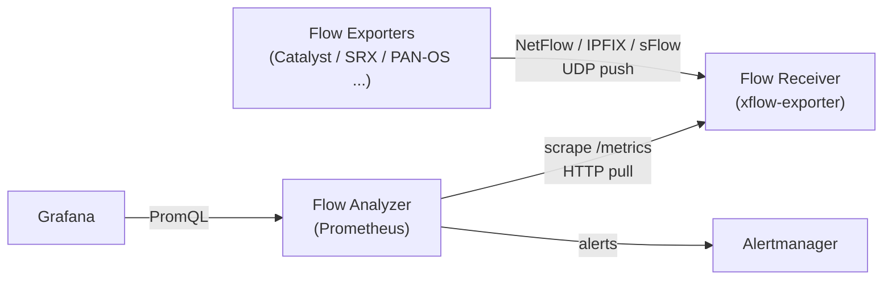

<div align="center">

  <h1>xflow-exporter</h1>

  <p>A Prometheus Exporter for traffic flows: NetFlow, IPFIX and sFlow.</p>

</div>

## Overview

This exporter receives flow records from on-premises network devices and serves aggregated Prometheus metrics.

- 📥 **Push-to-Pull Bridge**: Receives UDP flow exports and serves them to Prometheus scrapes
- 🧮 **In-Memory Aggregation**: Bounded-cardinality tables with Top-K and idle eviction
- 🧭 **Router-Scoped Parsing**: Template caches keyed by exporter address and Observation Domain ID
- 📊 **Native Histograms**: Flow size and duration distributions in single series

> [!IMPORTANT]
> This project is pre-1.0: a minor release may rename or remove a metric. Read the [CHANGELOG](CHANGELOG.md) before upgrading.

## Architecture

Prometheus is pull-based, while flow export is push-based. This exporter is the bridge between the two: devices push flow datagrams into it, and Prometheus pulls aggregates out of it.



A scrape reads the in-memory aggregation tables and never waits on flow arrival. Mind the naming collision: in flow terminology the device is the "exporter", so the `exporter` label always names the device, never this binary.

## Quick Start

### 1. Point your devices at the exporter

Configure each device to export flows to the exporter's address, UDP port 2055 by default. Every listener accepts every supported protocol, identified per datagram.

### 2. Run the exporter with Docker

```bash
docker run -p 10052:10052 -p 2055:2055/udp \
  ghcr.io/umatare5/xflow-exporter:latest \
  --collector.exporters --collector.hosts
```

> [!Tip]
> If you prefer using binaries, download them from the [release page](https://github.com/umatare5/xflow-exporter/releases).
>
> Supported Platforms are: `linux_amd64`, `linux_arm64`, `darwin_amd64`, `darwin_arm64` and `windows_amd64`

### 3. Scrape it

See [Prometheus Configuration](#prometheus-configuration) for the job and the alerting rules.

## Protocol Support

NetFlow v5/v8/v9, NetFlow-Lite, IPFIX and sFlow v5, over plaintext UDP. See [docs/protocols.md](docs/protocols.md) for per-protocol behaviour and limits.

## Syntax

`xflow-exporter --help` prints every flag, and [docs/configuration.md](docs/configuration.md) carries the same list.

Each data collector is enabled per module:

| Module                      | Publishes                                        |
| :-------------------------- | :----------------------------------------------- |
| `--collector.exporters`     | Per-device traffic by `exporter` and `version`   |
| `--collector.hosts`         | Traffic per source-destination address pair      |
| `--collector.services`      | Traffic per address pair, protocol and port      |
| `--collector.asns`          | Traffic per AS pair from device-exported numbers |
| `--collector.applications`  | Traffic per AVC / App-ID / applicationId name    |
| `--collector.countries`     | Traffic per country pair, needs a country database   |
| `--collector.threats`       | Traffic per flagged address, needs a list file   |
| `--collector.distributions` | Flow size and duration native histograms         |

Optional enrichment fills dimensions a device did not export, each off by default: `--enrich.services` names an application from its port, and `--enrich.asn-database`, `--enrich.country-database` and `--enrich.threat-file` read files held locally. See [docs/README.md](docs/README.md#enrichment).

> [!Note]
> This exporter fetches nothing. [`scripts/fetch-threat-lists.sh`](scripts/fetch-threat-lists.sh) downloads and merges the published threat lists, and `/-/reload` picks up what it left behind — the same shape the MaxMind databases are already kept in.

`--remote-write.url` ships the same registry to a Remote Write 2.0 endpoint for the deployments a scrape cannot reach, alongside or instead of `/metrics`.

The operational knobs live under `--receiver.*`, `--parser.*` and `--aggregation.*`. On Linux the read loops use `recvmmsg` batching — other platforms read one datagram per call.

## Endpoints

The exporter serves three endpoints:

- `/` — landing page, which confirms the exporter is running when reached at <http://localhost:10052/>
- `/metrics` — metrics endpoint, configurable via `--web.telemetry-path`
- `/healthz` — liveness probe, which returns a static 200 and deliberately ignores flow reception
- `/-/reload` — re-reads the enrichment sources on POST or PUT, exposed only with `--web.enable-lifecycle`. A `SIGHUP` does the same without the flag

## Metrics

This exporter aggregates flows into six modules, documented in [docs/collectors.md](docs/collectors.md):

| Module          | Metric family (representative)   | Labels                             |
| :-------------- | :------------------------------- | :--------------------------------- |
| `exporters`     | `xflow_exporter_bytes_total`     | `exporter,version`                 |
| `hosts`         | `xflow_host_pair_bytes_total`    | `exporter,src,dst`                 |
| `services`      | `xflow_service_bytes_total`      | `exporter,src,dst,proto,port`      |
| `asns`          | `xflow_asn_pair_bytes_total`     | `exporter,src_asn,dst_asn`         |
| `applications`  | `xflow_application_bytes_total`  | `exporter,application`             |
| `countries`     | `xflow_country_pair_bytes_total` | `exporter,src_country,dst_country` |
| `threats`       | `xflow_threat_bytes_total`       | `exporter,address,direction`       |
| `distributions` | `xflow_flow_bytes`               | `exporter` — native histogram      |

See [docs/README.md](docs/README.md) for the absence, folding, eviction and sampling-correction semantics every module shares.

> [!Important]
>
> All collector modules are **disabled by default** to bound cardinality, and everything folded lands in a single series whose labels read `other`.
>
> - Each table family carries `_bytes_total`, `_packets_total` and `_flows_total` — bytes and packets are sampling-corrected.
> - An entry idle past `--aggregation.entry-ttl` is evicted and its series disappears — a flow nobody has seen is gone, not zero.
> - `distributions` needs Prometheus v3.8+ with native histogram ingestion enabled in the scrape configuration.

### Exporter Health Metrics

These series describe the exporter itself. They have no module and no collector flag.

| Metric                                     | Type    | Description                                         |
| :----------------------------------------- | :------ | :-------------------------------------------------- |
| `xflow_build_info`                         | Gauge   | Exporter version in the `version` label, always 1   |
| `xflow_receiver_packets_total`             | Counter | Datagrams received per `listener`, dropped included |
| `xflow_receiver_bytes_total`               | Counter | Payload bytes received per `listener`               |
| `xflow_receiver_read_errors_total`         | Counter | Socket read failures per `listener`                 |
| `xflow_receiver_dropped_packets_total`     | Counter | Drops per `listener` and `reason` before decoding   |
| `xflow_receiver_queue_length`              | Gauge   | Datagrams waiting between read loops and decoders   |
| `xflow_receiver_queue_capacity`            | Gauge   | Bound of that queue                                 |
| `xflow_flows_total`                        | Counter | Records decoded per `exporter` and `version`        |
| `xflow_decode_errors_total`                | Counter | Rejections per `exporter`, `version` and `reason`   |
| `xflow_last_flow_timestamp_seconds`        | Gauge   | Unix time of the exporter's last decoded datagram   |
| `xflow_templates`                          | Gauge   | Unexpired templates per `exporter`, `odid`, `type`  |
| `xflow_sequence_missed_total`              | Counter | Export packets lost per `exporter` and `odid`       |
| `xflow_sampling_rate`                      | Gauge   | Declared sampling rate, absent until one arrives    |
| `xflow_aggregation_entries`                | Gauge   | Entries held per `aggregation` table                |
| `xflow_aggregation_evictions_total`        | Counter | Idle entries evicted per `aggregation`              |
| `xflow_aggregation_overflow_records_total` | Counter | Records folded into `other` by the entry bound      |

The `reason` label values are catalogued in [docs/collectors.md](docs/collectors.md).

> [!Important]
>
> Alert on freshness with `time() - xflow_last_flow_timestamp_seconds`. A silent device stops moving its timestamp while every counter freezes, and nothing else can tell that from a healthy quiet network.

## Use Cases

### Basic Usage - No Collectors

```bash
$ ./xflow-exporter --log.format text
time=2026-08-26T19:58:24.288+09:00 level=INFO msg="Starting xflow-exporter" version=0.1.0 listen_address=0.0.0.0 listen_port=10052 telemetry_path=/metrics
time=2026-08-26T19:58:24.291+09:00 level=INFO msg="Flow receiver listening" listener=:2055
time=2026-08-26T19:58:24.292+09:00 level=INFO msg="HTTP server listening" addr=0.0.0.0:10052
```

The receiver listens and the health series count every datagram, but no traffic series is published.

### Essential Usage

```bash
./xflow-exporter \
  --collector.exporters --collector.hosts --collector.services
```

### Complete Usage

For complete monitoring, see [`.air.toml`](https://github.com/umatare5/xflow-exporter/blob/main/.air.toml) which enables every collector module.

### Prometheus Configuration

#### Job Configuration Example

Add the job config to your Prometheus YAML file using [examples/prometheus.yml](./examples/prometheus.yml) as a reference.

#### Alerting Rules Configuration Example

Add the alerting rules to your Prometheus YAML file using [examples/prometheus_alert_rules.yml](./examples/prometheus_alert_rules.yml) as a reference.

## Contributing

See [CONTRIBUTING.md](CONTRIBUTING.md) for the `make` targets, the Docker build, the release process and how to open a pull request.

## Licence

[MIT](LICENSE). The binary statically links Apache-2.0, MIT, ISC and BSD 3-Clause dependencies, whose notices are reproduced in [NOTICE](NOTICE) and shipped alongside `LICENSE` in every release archive and container image.
