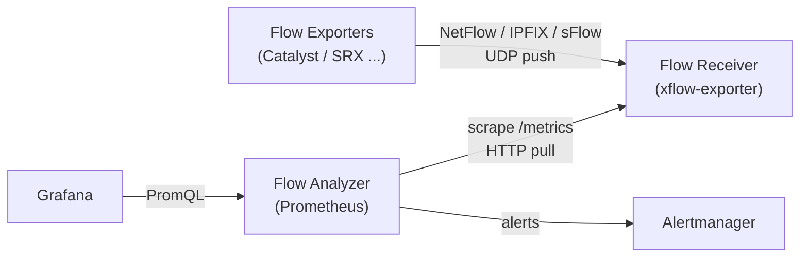
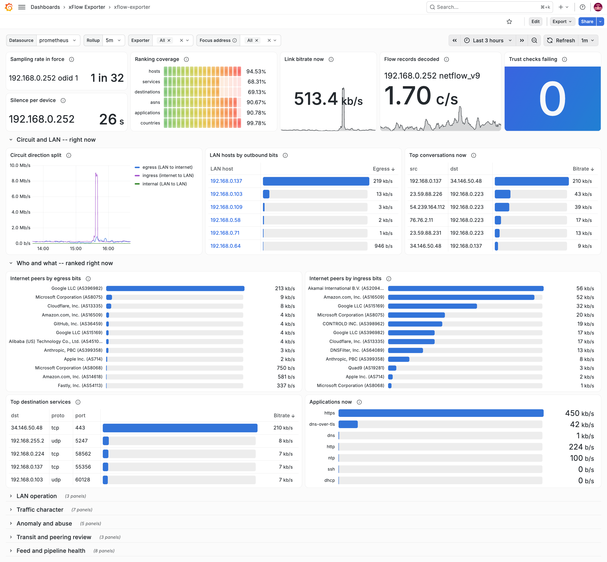

<div align="center">

  <picture>
    <source media="(prefers-color-scheme: dark)" srcset="./docs/assets/logo_dark.png" width="115px" />
    <source media="(prefers-color-scheme: light)" srcset="./docs/assets/logo.png" width="115px" />
    
  </picture>

  <h1>xflow-exporter</h1>

  <p>A Prometheus Exporter for traffic flows: NetFlow, IPFIX and sFlow.</p>

  <p>
    
    <a href="https://github.com/umatare5/xflow-exporter/actions/workflows/go-test-build.yml"></a>
    <a href="https://github.com/umatare5/xflow-exporter/actions/workflows/go-vulncheck.yml"></a><br>
    
    <a href="https://www.bestpractices.dev/projects/14363"></a>
    <a href="./LICENSE"></a>
  </p>

</div>

## Overview

This exporter allows a Prometheus instance to scrape metrics from the NetFlow/IPFIX/sFlow datagrams.

- ⚙️ **Unifies Workflow**: Bundles collection, aggregation, and enrichment features into a single exporter
- 🧮 **In-Memory Aggregation**: Summarizes bounded-cardinality tables with Top-K and idle eviction
- 🏷️ **Metadata Enrichment**: Labels apps, ASNs, countries, threats, and VLANs from local files
- 📊 **Native Histograms**: Yields size and duration quantiles with high accuracy (Prometheus v3.8+)

## Architecture

Network devices push flow datagrams into the exporter, and Prometheus pulls aggregates out of it.



This architecture suits **lightweight traffic analysis** in enterprise and small-to-medium data centers, where the resource and cost budgets are small. It does not suit **heavy traffic analysis** in large-scale data centers, clouds or ISPs, nor **digital forensics** in the security domain.

> [!NOTE]
> Scrapes read the aggregation tables as they stand, never waiting for a flow. See [Scrape Path](docs/architecture.md#scrape-path) for the details.

## Supported Environment

**NetFlow v5, v8, v9, IPFIX** and **sFlow v5**, every one of them on the same receiver port.

> [!TIP]
> A datagram's leading bytes name the protocol, not the port it arrived on. See [Version Identification](docs/protocols.md#version-identification) for how the decoder reads them.

## Installation

This exporter supports container images and OS-specific binaries.

```bash
docker pull ghcr.io/umatare5/xflow-exporter
```

Or, download the binaries from [Releases](https://github.com/umatare5/xflow-exporter/releases). `(linux|darwin)_(amd64|arm64)` and `windows_amd64` are supported.

## Quick Start

This exporter needs a network device exporting flows to it first.

### 1. Export flows from the network device

Send flows to the exporter's `4739/udp`, the IANA registered port for IPFIX.

For example, on **Cisco C2960CX** and **NetFlow v9**, use the following configuration to export flows:

```bash
# 1. Create minimum set of flow records
flow record MINIMAL_FLOW_RECORDS_IPV4
  match ipv4 tos                       # For DSCP
  match ipv4 protocol                  # For the protocol type - 6: TCP, 17: UDP
  match ipv4 source address            # Required: Source IP address of the flow
  match ipv4 destination address       # Required: Destination IP address of the flow
  match transport source-port          # Required: Source port of the flow
  match transport destination-port     # Required: Destination port of the flow
  collect transport tcp flags          # Collect TCP flags
  collect interface input              # Collect input interface
  collect flow sampler                 # Collect flow sampler information
  collect counter bytes long           # Collect byte count of the flow
  collect counter packets long         # Collect packet count of the flow

# 2. Configure the flow exporter
flow exporter XFLOW-EXPORTER
  destination 192.0.2.1               # IP address of xflow-exporter
  transport udp 4739                  # Listen port of xflow-exporter
  source Vlan100                      # Source interface for the flow exporter
  template data timeout 60            # Timeout for the template data in seconds
  option sampler-table timeout 60     # Timeout for the sampler table in seconds

# 3. Set up the flow monitor
flow monitor EXAMPLE_FLOW_MONITOR
  exporter XFLOW-EXPORTER
  record MINIMAL_FLOW_RECORDS_IPV4

# 4. Create the sampler
sampler MINIMAL_RESOLUTION_SAMPLER
  mode random 1 out-of 1022            # Window size to select packets from. On C2960CX, the range is <32-1022>.

# 5. Apply the sampler to the interface
interface GigabitEthernet0/1
  ip flow monitor EXAMPLE_FLOW_MONITOR sampler MINIMAL_RESOLUTION_SAMPLER input

# 6. Verify the configuration and flow records
show flow monitor EXAMPLE_FLOW_MONITOR

# TIP: With the "cache" argument, the command displays the detailed flow records.
# show flow monitor EXAMPLE_FLOW_MONITOR cache
```

### 2. Run the exporter with Docker

```bash
docker run -p 10053:10053 -p 4739:4739/udp \
  ghcr.io/umatare5/xflow-exporter:v0.12.0 --collector.exporters
```

### 3. Scrape the metrics

```bash
curl http://localhost:10053/metrics
```

> [!TIP]
> See [Collectors](#collectors) for the complete metrics, and [Prometheus Configuration](#prometheus-configuration) for scrape jobs and alerting rules.

## Configuration

This exporter uses command-line flags for all configuration.

### Flags

`xflow-exporter --help` prints full flags. See [Help](docs/help.md) for details.

| Component    | Flag               | Description                                                             |
| :----------- | :----------------- | :---------------------------------------------------------------------- |
| Collector    | `--collector.*`    | Which collectors register. See [Collectors](#collectors).               |
| Endpoint     | `--web.*`          | The listen address and the telemetry path. See [Endpoints](#endpoints). |
| Receiver     | `--receiver.*`     | The sockets, the ingest queue and the decode workers.                   |
| Parser       | `--parser.*`       | The NetFlow v9 and IPFIX template cache.                                |
| Aggregation  | `--aggregation.*`  | The entry bound, the idle TTL and the scrape-time cut.                  |
| Enrichment   | `--enrich.*`       | The local files that fill the labels a device omits.                    |
| Remote Write | `--remote-write.*` | The Remote Write 2.0 endpoint and its credential.                       |

### Collectors

The `--collector.*` flags toggle these collectors. See [Collectors](docs/collectors.md) for details.

| Collector     | Flag                        | Description                                |
| :------------ | :-------------------------- | :----------------------------------------- |
| Applications  | `--collector.applications`  | Traffic per application – `--enrich.*`     |
| BGP AS        | `--collector.asns`          | Traffic per AS pair – `--enrich.*`         |
| Countries     | `--collector.countries`     | Traffic per country pair – `--enrich.*`    |
| Destinations  | `--collector.destinations`  | Traffic per destination, protocol, port    |
| Distributions | `--collector.distributions` | Flow size and duration native histograms   |
| DSCP          | `--collector.dscp`          | Traffic per DSCP class                     |
| Exporter      | `--collector.exporters`     | Traffic per observation domain             |
| Hosts         | `--collector.hosts`         | Traffic per source-destination pair        |
| Services      | `--collector.services`      | Traffic per address pair, protocol, port   |
| TCP Flags     | `--collector.tcp-flags`     | Traffic per TCP control-bit profile        |
| Threats       | `--collector.threats`       | Traffic per flagged address – `--enrich.*` |
| VLANs         | `--collector.vlans`         | Traffic per VLAN pair – `--enrich.*`       |

> [!IMPORTANT]
> All collectors are **disabled by default**. Enable them based on the requirements.

> [!TIP]
> `--collector.distributions` needs Prometheus v3.8+ with native histogram ingestion in the scrape config.

### Endpoints

The exporter exposes these endpoints. See [Endpoints](docs/architecture.md#endpoints) for what each status code means.

| Path        | Description                                      |
| :---------- | :----------------------------------------------- |
| `/`         | Landing page, confirming the exporter is up      |
| `/metrics`  | Metrics endpoint, set by `--web.telemetry-path`  |
| `/entries`  | Entry listing, ranking every entry a table holds |
| `/healthz`  | Liveness probe, ignoring flow data               |
| `/-/reload` | Reload endpoint, re-reading the enrichment files |

> [!NOTE]
> `/entries` needs `--web.enable-aggregation-entries` and `/-/reload` needs `--web.enable-lifecycle`. A flag left unset leaves its route unregistered, and the landing page answers that path instead.

## Metrics

This exporter exposes metrics for various aspects of network traffic.

### Collector Metrics

The following table summarizes the popular metrics. See [Collectors](docs/collectors.md) for the complete metrics.

| Collector     | Metric                          | Type      | Description            |
| :------------ | :------------------------------ | :-------- | :--------------------- |
| Exporter      | `xflow_exporter_bytes_total`    | Counter   | Traffic per domain     |
| Hosts         | `xflow_host_pair_bytes_total`   | Counter   | Top talkers            |
| Services      | `xflow_service_bytes_total`     | Counter   | Top conversations      |
| Applications  | `xflow_application_bytes_total` | Counter   | Traffic by application |
| Distributions | `xflow_flow_bytes`              | Histogram | Flow size distribution |

### Exporter Health Metrics

The following table summarizes the health metrics of the exporter itself. See [Exporter Health](docs/health.md) for details.

| Metric                                 | Type    | Description                            |
| :------------------------------------- | :------ | :------------------------------------- |
| `xflow_flows_total`                    | Counter | Records decoded per device and version |
| `xflow_decode_errors_total`            | Counter | Rejections per device and reason       |
| `xflow_last_flow_timestamp_seconds`    | Gauge   | Unix time of the last record           |
| `xflow_receiver_dropped_packets_total` | Counter | Pre-decode drops per listener          |
| `xflow_sampling_rate`                  | Gauge   | Rate in force per domain               |
| `xflow_aggregation_entries`            | Gauge   | Entries held per aggregation table     |

## Examples

There are several operational examples below.

### Exporter Configuration

The three patterns below cover the common use cases.

**Minimal Pattern**: With no collector enabled, the receiver counts every datagram and publishes no traffic series.

```bash
./xflow-exporter
```

**Standard Pattern**: The three collectors most deployments start from.

```bash
./xflow-exporter --collector.exporters --collector.hosts --collector.services
```

**Complete Pattern**: Every collector registers, and every enrichment source is named.

```bash
./xflow-exporter \
  --collector.exporters --collector.hosts --collector.services \
  --collector.destinations --collector.tcp-flags --collector.dscp \
  --collector.asns --collector.applications --collector.countries \
  --collector.threats --collector.vlans --collector.distributions \
  --enrich.services \
    --enrich.asn-database ./tmp/asn.mmdb \
    --enrich.country-database ./tmp/country.mmdb \
    --enrich.threat-file ./tmp/threat-ips.txt \
    --enrich.mapping-file ./tmp/mapping.yml \
  --web.enable-lifecycle --web.enable-aggregation-entries
```

> [!NOTE]
> See [`.air.toml`](./.air.toml) for the development configuration this pattern is taken from.

### Prometheus Configuration

See the following Prometheus configuration examples:

- **Example Job**: Add from [`examples/prometheus.yml`](./examples/prometheus.yml) to your Prometheus.
- **Example Recording Rules**: Add from [`examples/prometheus_record_rules.yml`](./examples/prometheus_record_rules.yml) to your Prometheus.
- **Example Alerting Rules**: Add from [`examples/prometheus_alert_rules.yml`](./examples/prometheus_alert_rules.yml) to your Prometheus.

### Grafana Dashboard

Import [`examples/grafana_xflow-exporter-dashboard.json`](./examples/grafana_xflow-exporter-dashboard.json) and visualize the metrics.

<picture>
  <source media="(prefers-color-scheme: dark)" srcset="./docs/assets/xflow-exporter-dashboard_dark.png">
  <source media="(prefers-color-scheme: light)" srcset="./docs/assets/xflow-exporter-dashboard.png">
  
</picture>

> [!TIP]
> See [`docs/assets/xflow-exporter-dashboard_full.png`](./docs/assets/xflow-exporter-dashboard_full.png) for the full capture.

## Documentation

The following pages detail additional information.

- **[Architecture](docs/architecture.md)** – the receive path, the bounded state and the absence rules.
- **[Protocols](docs/protocols.md)** – the wire formats and the devices each decoder was read on.
- **[Enrichment](docs/enrichment.md)** – the local files that fill labels, and what a reload re-reads.

## Contributing

See [`CONTRIBUTING.md`](CONTRIBUTING.md) for development setup, test conventions and others.

## License

MIT. The binary statically links Apache-2.0, MIT, ISC and BSD 3-Clause dependencies. Their notices are reproduced in [`NOTICE`](NOTICE) and shipped alongside [`LICENSE`](LICENSE) in every release archive and container image.
