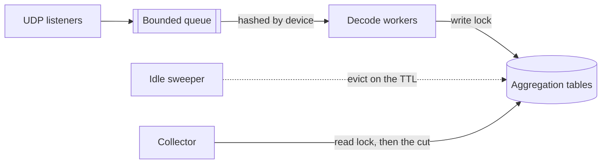

# Documentation

Reference pages for xflow-exporter.

The [README](../README.md) covers getting flows received and scraped; these pages carry the catalogues, the files an operator supplies and the behaviour every collector shares.

| Page                        | Focus                                        |
| :-------------------------- | :------------------------------------------- |
| [Collectors](collectors.md) | The traffic collectors and their labels      |
| [Health](health.md)         | The exporter's own metrics and reasons       |
| [Enrichment](enrichment.md) | The local files that fill labels, and reload |
| [Protocols](protocols.md)   | Per-protocol behaviour and limits            |
| [Help](help.md)             | Flags and defaults, as `--help` prints       |

## Technical Information

### Push and Pull

- **Scrapes never wait** — a scrape reads the tables as they stand, whatever is arriving.
- **No target to probe** — nothing answers an `up`-style reachability check toward a sender.
- **Liveness** — `xflow_last_flow_timestamp_seconds` is what silence is read from.
- **Naming** — RFC 7011 calls the device the exporter, and `exporter_address` is where it lands.
- **Tuning** — `--receiver.*`, `--parser.*` and `--aggregation.*` bound the receive path.
- **Batching** — Linux read loops use `recvmmsg`, and elsewhere it is one per call.
- **Ordering** — every datagram of one device decodes on one worker, chosen by hashing its address.

### Endpoints

Every route answers on the address `--web.listen-address` and `--web.listen-port` bind, and none of them authenticates — [`SECURITY.md`](../SECURITY.md) carries the path they belong on.

- **`/` is the fallback** — the mux routes every path no handler claims to the landing page, so an unregistered path answers 200 with HTML rather than 404.
- **`/healthz` reads nothing** — it answers 200 to any method, so a quiet network cannot make an orchestrator restart the exporter and lose its tables.
- **`/-/reload` is POST or PUT** — another method answers 405 with an `Allow` header, a failed reload 500 with its reason, and a success `Reloaded`.
- **Unexposed means unregistered** — without `--web.enable-lifecycle` the path falls through to the landing page, so a `POST /-/reload` answers 200 and reloads nothing.
- **Ten scrapes in flight** — `/metrics` answers an eleventh concurrent request with 503 rather than queueing it, which bounds the registry gathers.
- **Shutdown** — SIGINT or SIGTERM stops the listeners and gives the requests in flight five seconds before the process exits, cutting a slower scrape.
- **SIGHUP reloads** — the sources are re-read without the endpoint — [Reloading](enrichment.md#reloading) carries the path.

### Absence

A dimension the record did not carry produces no series — never `0`, `false` or an epoch instant.

- **Ingest** — a record without addresses feeds no host entry, one without an application none.
- **NetFlow v8** — an aggregate feeds only the tables its method's dimensions cover.
- **Eviction** — an entry idle past `--aggregation.entry-ttl` is removed with its series.
- **Freshness** — the timestamp appears on the first decode, the rate on the first rate.

### Counter Semantics

The counters of every collector accumulate from entry creation, and an entry evicted then re-created restarts at zero rather than resuming its total.

- **Rebirth** — Prometheus's staleness marker separates the old series from the new one.
- **Folding** — `other` carries what `--aggregation.max-entries` rejected at ingest.
- **Not folded** — neither the tail below the Top-K cut nor an evicted entry's totals.
- **Flow counts** — `_flows_total` is as exported, never multiplied by a sampling rate.

> [!NOTE]
> The tail is still accumulating, so summing it per scrape would make the counter fall whenever an entry is evicted or grows into the cut. An evicted entry's bytes already reached Prometheus on its own series, so folding them again would make `sum(rate())` over the family read twice what was ingested.

### Sampling Correction

`_bytes_total` and `_packets_total` carry the record's value times the rate in force at decode.

- **Sources** — the v5 header interval, the v9/IPFIX options rates, sFlow's inline rate.
- **Precedence** — the options pairs rank as [Protocols](protocols.md#options-templates) tabulates.
- **Audit** — `xflow_sampling_rate` publishes the rate a v9 or IPFIX domain declared.
- **Unsampled** — a record carrying no rate multiplies by one, which is the unsampled reading.

> [!NOTE]
> The v5 header interval and sFlow's inline rate ride the records themselves, so a device exporting either corrects its counts with no rate series to audit them by.

### Enrichment

An `--enrich.*` source fills a dimension the device did not export and never overwrites one it did — [Enrichment](enrichment.md) carries the sources, their file rules and the reload path.

- **Never overwrites** — an exported reading wins, so enrichment fills absence alone.
- **Feeds the existing families** — a dimension keys its collector, a name rides its own series.
- **Cardinality** — filling a dimension creates series that were absent, hence the opt-in.

### Bounded State

Every map keyed by wire data carries a bound, a push protocol not choosing its senders.

| Bounded                           | Limit                                        | Past it                                     |
| :-------------------------------- | :------------------------------------------- | :------------------------------------------ |
| Observation domains per device    | [256](../internal/decoder/templates.go#L26)  | Datagram discarded, counting `domain_limit` |
| Templates per domain              | [8192](../internal/decoder/templates.go#L18) | Expired go first, then `invalid_template`   |
| Interned vendor strings           | [65536](../internal/decoder/apps.go#L143)    | Copied per occurrence, not refused          |
| One vendor string                 | [255 B](../internal/decoder/apps.go#L150)    | Refused like invalid UTF-8, once per field  |
| Announced applications per device | [16384](../internal/decoder/apps.go#L38)     | Stays numbered rather than named            |
| Devices holding decode statistics | [65536](../internal/decoder/stats.go#L29)    | Decodes, but no per-device health series    |
| AS names held from the database   | [65536](../internal/enrich/mmdb.go#L86)      | Unnamed, so a join finds nothing            |

- **Announced applications** — the bound is ten times the 1500 an NBAR2 pack names.
- **Refusal counters** — the four `_refused_total` series count attempts, not entities.
- **Fallback** — a refused vendor string leaves the record numbered, or with no name.
- **Sweeps** — idle domains go on the template TTL, idle devices only at the budget.
- **Source-address keyed** — the application tables and the histograms carry no budget, so who may reach the receiver port is their bound — [`SECURITY.md`](../SECURITY.md) carries the filter.

> [!NOTE]
> A refused device keeps decoding and keeps feeding every aggregation table, but reaches no per-device health series. A device that has gone silent keeps the freshness series an alert on silence has to read. The per-device application tables and the distribution histograms key on the source address alone. [Health](health.md) carries what each refusal costs the records behind it.

### Reason Values

The `reason` label of `xflow_decode_errors_total` and `xflow_receiver_dropped_packets_total` is a closed set the wire cannot extend — [Health](health.md#specifications) tabulates both.

### Templates

NetFlow v9 and IPFIX data decode against templates cached per exporter address, protocol and Observation Domain ID together — [Protocols](protocols.md#netflow-v9-and-ipfix) carries the scope rationale, the refusal conditions and the expiry rule.

### Packet Sections

A record carrying one sampled packet section instead of parsed flow fields decodes through the header walk the sFlow decoder uses — [Protocols](protocols.md#packet-sections) carries the elements, the precedence and the padding ambiguity.

### Native Histograms

`--collector.distributions` publishes `xflow_flow_bytes` and `xflow_flow_duration_seconds` as native histograms that reach a scrape alone — [Collectors](collectors.md#specifications) carries what each observes and the scrape option they need.

### Remote Write

`--remote-write.url` ships the registry's counters and gauges to a Remote Write 2.0 endpoint, alongside or instead of `/metrics` — [Health](health.md#specifications) carries the four series that account for it.

- **Cardinality is the caller's to bound** — Top-K bounds the live set, not the stored one.
- **Aggregate before shipping** — recording rules, or `write_relabel_configs` to drop.
- **Nothing filters itself** — neither the writer nor a scrape drops a series on its own.

> [!NOTE]
> The address-keyed families turn their Top-K over as talkers come and go, measured at 5.3× the live series count per hour for `xflow_service_*` on a quiet link. The figure predates the ordering fix that removed the share a byte tie was causing. The dimensional families — `asns`, `applications`, `tcp_flags`, `dscp` and `countries` — stay flat at 1.0×.

### Recording Rules

[`examples/prometheus_record_rules.yml`](../examples/prometheus_record_rules.yml) collapses the pair- and tuple-keyed families onto one dimension with `sum without()`, in seven groups.

- **A ranking, not a total** — the tail below the Top-K cut reaches no recorded series.
- **The one exception** — `xflow_exporter_*` takes no cut, so the ratios divide by it.
- **`exporter_address` is kept** — two observation points in one path export a flow twice.
- **Ordering** — a derived rule reads only rules recorded earlier in its own group.
- **Scrape path only** — `--remote-write.url` ships the registry no rule has seen.

> [!NOTE]
> The volumetric aggregates read `destinations` rather than `services`: the service family keys on the source as well, so a distributed flood opens one entry per attacker and falls out of the cut. The destination family folds the source at ingest and stays the largest entry in its table. A reflected flood arrives with a randomized destination port and scatters past the cut in either, which is what `exporter:xflow_destination_bytes:ratio5m` exists to show. The rate window assumes the 60s `scrape_interval` of [`examples/prometheus.yml`](../examples/prometheus.yml).

### Dashboards

[`examples/grafana_xflow-exporter-dashboard.json`](../examples/grafana_xflow-exporter-dashboard.json) covers reception and decoding, throughput per device, the Top-K composition views, the aggregation tables and the enrichment sources. The data source and the devices are variables.

- **Panels rank by packets, not bytes** — a byte figure adds packet-size variance on top.
- **A ranking, not a total** — entries below the Top-K cut publish nothing at all.

> [!NOTE]
> Both counts are sampled estimates, so read volume as a proportion. An exact figure comes from the device's own SNMP interface counters.
