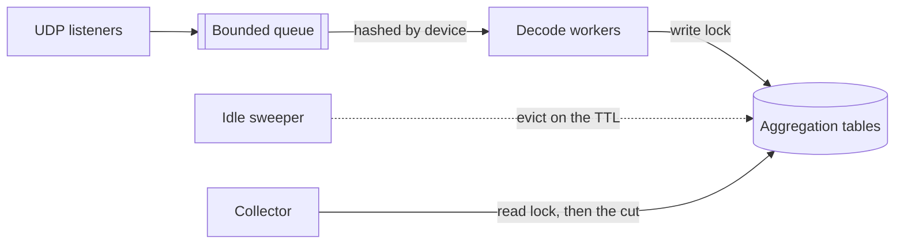

# Documentation

Reference pages for xflow-exporter.

The [README](../README.md) covers getting flows received and scraped; these pages carry the catalogues and the behaviour every module shares.

| Page                              | Focus                                  |
| :-------------------------------- | :------------------------------------- |
| [Protocols](protocols.md)         | Per-protocol behaviour and limits      |
| [Collectors](collectors.md)       | The traffic modules and their labels   |
| [Health](health.md)               | The exporter's own metrics and reasons |
| [Help](help.md)                   | Flags and defaults, as `--help` prints |

## Technical information

### Push and pull

- **Scrapes never wait** — a scrape reads the tables as they stand, whatever is arriving.
- **No target to probe** — nothing answers an `up`-style reachability check toward a sender.
- **Liveness** — `xflow_last_flow_timestamp_seconds` is what silence is read from.
- **Naming** — RFC 7011 calls the device the exporter, and `exporter_address` is where it lands.
- **Tuning** — `--receiver.*`, `--parser.*` and `--aggregation.*` bound the receive path.
- **Batching** — Linux read loops use `recvmmsg`, and elsewhere it is one per call.
- **Ordering** — every datagram of one device decodes on one worker, chosen by hashing its address.



### Absence

A dimension the record did not carry produces no series — never `0`, `false` or an epoch instant.

- **Ingest** — a record without addresses feeds no host entry, one without an application none.
- **NetFlow v8** — an aggregate feeds only the tables its method's dimensions cover.
- **Eviction** — an entry idle past `--aggregation.entry-ttl` is removed with its series.
- **Freshness** — the timestamp appears on the first decode, the rate on the first rate.

### Counter semantics

Table families accumulate from entry creation, and an entry evicted then re-created restarts at zero.

- **Rebirth** — Prometheus's staleness marker separates the old series from the new one.
- **Folding** — `other` carries what `--aggregation.max-entries` rejected at ingest.
- **Not folded** — neither the tail below the Top-K cut nor an evicted entry's totals.
- **Flow counts** — `_flows_total` is as exported, never multiplied by a sampling rate.

> [!NOTE]
> The tail is still accumulating, so summing it per scrape would make the counter fall whenever an entry is evicted or grows into the cut. An evicted entry's bytes already reached Prometheus on its own series, so folding them again would make `sum(rate())` over the family read twice what was ingested.

### Sampling correction

`_bytes_total` and `_packets_total` carry the record's value multiplied by the rate in force at decode.

- **Sources** — the v5 header interval, the v9/IPFIX options rates, sFlow's inline rate.
- **Precedence** — the options pairs rank as [Protocols](protocols.md#options-and-enrichment) tabulates.
- **Audit** — `xflow_sampling_rate` publishes the rate a v9 or IPFIX domain declared.
- **Unsampled** — a record carrying no rate multiplies by one, which is the unsampled reading.

> [!NOTE]
> The v5 header interval and sFlow's inline rate ride the records themselves, so a device exporting either corrects its counts with no rate series to audit them by.

### Enrichment

An `--enrich.*` source supplies what the device did not: a dimension of the record itself, or a name for one the record carries as a number. Every source is off by default.

| Flag                        | Fills                                    |
| :-------------------------- | :--------------------------------------- |
| `--enrich.services`         | The application, from the transport port |
| `--enrich.asn-database`     | The AS numbers, from a MaxMind-format DB |
| `--enrich.country-database` | The ISO country codes, from the same     |
| `--enrich.threat-file`      | A flag on addresses a list file names    |
| `--enrich.mapping-file`     | Device, interface and port names         |

Lookups are local: nothing is fetched and no credential is held. Neither database ships here, so point the flag at a GeoLite2 or DB-IP file or fetch one with [`scripts/fetch-enrichment-data.sh`](../scripts/fetch-enrichment-data.sh). A path that cannot be opened fails startup.

- **Never overwrites** — an exported reading wins, so enrichment fills absence alone.
- **Feeds the existing families** — a dimension keys its module, a name rides its own series.
- **Cardinality** — filling a dimension creates series that were absent, hence the opt-in.
- **Observability** — `xflow_enrichment_lookups_total` splits by `enricher` and `result`.

> [!NOTE]
> A country is where the database registers the prefix, not where the traffic went: a lab in Japan reaching Cloudflare over AS 13335 measured `src_country="CA"`. Read `xflow_country_pair_*` that way, and do not reconcile it with a transit bill.

### Threat lists

`--enrich.threat-file` reads flagged addresses, one per line, and is repeatable so several lists combine into one set.

- **Format** — one per line; blank lines, `#` and `;` comments and trailing fields are skipped.
- **A prefix is not an address** — a CIDR line is skipped like any other non-address.
- **A line over 255 bytes fails the file** — nothing a list publishes is that long.
- **An unlisted address is not a clean one** — it is absence rather than a finding.
- **Both directions** — a hit on either address keys `direction="src"` or `direction="dst"`.
- **Size** — roughly 420,000 addresses, about 20 MiB, answering a lookup in nanoseconds.
- **License** — the lists the bundled script fetches are MIT and CC0, though others differ.

> [!IMPORTANT]
> `xflow_threat_skipped_lines` counts what a load passed over, blank lines and comments excluded, so a list published in CIDR notation shows its gap rather than reading as full coverage. An over-long line fails the whole file because the reader cannot resume past it, and a set silently missing its tail would under-flag. Several published aggregates inherit a non-commercial clause from an upstream feed.

> [!TIP]
> Fetching the files is the operator's job, and [`scripts/fetch-enrichment-data.sh`](../scripts/fetch-enrichment-data.sh) is one way to do it: it downloads, merges and deduplicates the published lists, and its `databases` subcommand takes the ASN and country databases from DB-IP unless `MAXMIND_LICENSE_KEY` is set. Both write where `THREAT_FILE`, `ASN_DATABASE` and `COUNTRY_DATABASE` point. It checks that each body names an address rather than trusting the status, refuses a merge below `MIN_ADDRESSES` (1000) and a multi-part list no part of which reached `SPLIT_PART_LINES` (131072), and exits non-zero naming its reason, so a bad fetch leaves the previous file in place. Run it from cron and reload afterwards.

### Mapping file

`--enrich.mapping-file` names devices and their interfaces, which this decoder does not read, and may name transport ports the built-in table does not cover.

```yaml
devices:
  192.0.2.1: # the flow's source address
    hostname: sw1.example.net # optional; without it the device gets no name
    interfaces: # ifIndex to ifName
      10102: Gi0/2
services: # port/proto, ahead of the built-in table
  5246/udp: capwap-control
  9200/tcp: elasticsearch
```

- **Two info series** — `xflow_device_info` and `xflow_interface_info` carry the names.
- **Strict** — an unusable key or name, or one address spelled twice, fails the whole load.
- **Exactly one document** — an empty file and a trailing `---` are both refused.
- **`devices: {}` loads** — emptying the file on purpose is how a reload takes names away.
- **YAML acts first** — a `~` key is dropped before any check, `%YAML 1.2` is refused.
- **`services:` outranks the built-in table** — on any port both of them name.
- **Application ports** — the built-in table names protocols rather than products.
- **One table at a time** — a source port here beats a destination port in the built-in one.
- **Cost follows key count, not file size** — 14,000 devices parse in 320 ms, where 1,000 of 48 ports each parse in 77 ms from a file 2.5 times larger.
- **Parsed whole before any lookup** — that larger file holds 37 MiB while it parses, which `--dry-run` and `/-/reload` each pay again.

> [!TIP]
> [`scripts/fetch-device-names.sh`](../scripts/fetch-device-names.sh) walks the devices over SNMP and writes the file. Nothing here speaks SNMP; the exporter reads what that left behind, so run it from cron and reload afterwards. It refuses a device answering no usable name rather than writing it out unnamed, and installs by rename, so a failed walk leaves the previous names in force. [`SECURITY.md`](../SECURITY.md) covers where the community string ends up.

This joins a name onto the per-interface traffic of one device, keeping the rows no name reaches:

```promql
sum by (exporter_address, ifname) (
  sum without (src, dst, output_ifindex) (rate(xflow_host_pair_bytes_total[5m]))
  * on (job, instance, exporter_address, input_ifindex) group_left (ifname)
    label_replace(xflow_interface_info, "input_ifindex", "$1", "ifindex", "(.+)")
)
or
sum by (exporter_address, input_ifindex) (
  sum without (src, dst, output_ifindex) (rate(xflow_host_pair_bytes_total[5m]))
  unless on (job, instance, exporter_address, input_ifindex)
    label_replace(xflow_interface_info, "input_ifindex", "$1", "ifindex", "(.+)")
)
```

> [!IMPORTANT]
> `job` and `instance` belong in `on()`: two Prometheus targets scraping one device make the match many-to-many, which fails the whole evaluation. Neither branch may filter `exporter_address!="other"`. A negative matcher also matches a series lacking the label, so the fold row would fall out of both and the total would drop by what the entry bound folded.

### Reloading

`--web.enable-lifecycle` exposes `/-/reload`, which re-reads every enrichment source. A `SIGHUP` does the same without the flag.

- **POST or PUT only**, and unexposed by default, a reload being a write rather than a read.
- **A failed reload keeps the previous data** — the set already loaded stays in force.
- **Atomic** — a new set is built whole before it replaces the old one, so no lookup pauses.
- **Only the sources startup opened** — a reload re-reads their files, never the flags.
- **`--dry-run` opens every source** — it binds no listener, so a port already taken is not its answer.

> [!NOTE]
> A list gone missing would otherwise unflag every address at once, which reads as a network that had just gone clean; `xflow_threat_reload_failures_total` counts those loads. The mapping file has no such counter, mirroring the databases: a failed load answers `/-/reload` with 500 and logs its reason. Each mmdb reader is replaced rather than reopened, so a lookup never sees a half-loaded set and the decode path never pauses. [`SECURITY.md`](../SECURITY.md) covers the exposure.

### Bounded state

Every map keyed by wire data carries a bound, a push protocol not choosing its senders.

| Bounded                           | Limit                                        | Past it                                                    |
| :-------------------------------- | :------------------------------------------- | :--------------------------------------------------------- |
| Observation domains per device    | [256](../internal/decoder/templates.go#L26)  | The datagram is discarded, counting `domain_limit`         |
| Templates per domain              | [8192](../internal/decoder/templates.go#L18) | Expired templates go first, then `invalid_template`        |
| Interned vendor strings           | [65536](../internal/decoder/apps.go#L143)    | The value is copied per occurrence rather than refused     |
| One vendor string                 | [255 B](../internal/decoder/apps.go#L150)    | Refused, as invalid UTF-8 is, counting once per field      |
| Announced applications per device | [16384](../internal/decoder/apps.go#L38)     | The application stays numbered rather than named           |
| Devices holding decode statistics | [65536](../internal/decoder/stats.go#L29)    | The device decodes but reaches no per-device health series |
| AS names held from the database   | [65536](../internal/enrich/mmdb.go#L86)      | The AS goes unnamed, which a join shows by finding nothing |

- **Announced applications** — the bound is ten times the 1500 an NBAR2 pack names.
- **Refusal counters** — the four `_refused_total` series count attempts, not entities.
- **Fallback** — a refused vendor string leaves the record numbered, or with no name.
- **Sweeps** — idle domains go on the template TTL, idle devices only at the budget.
- **Not wire-keyed** — bound the source-address maps at the receiver ([`SECURITY.md`](../SECURITY.md)).

> [!NOTE]
> A refused device keeps decoding and keeps feeding every aggregation table, but reaches no per-device health series; a device that has gone silent keeps the freshness series an alert on silence has to read. The per-device application tables and the distribution histograms key on the source address alone. [Health](health.md) carries what each refusal costs the records behind it.

### Reason values

The `reason` label of `xflow_decode_errors_total` and `xflow_receiver_dropped_packets_total` is a closed set — [Health](health.md#specifications) tabulates both.

### Templates

NetFlow v9 and IPFIX data decode against templates cached per exporter address, protocol and Observation Domain ID together — [Protocols](protocols.md#netflow-v9-and-ipfix) carries the scope rationale, the refusal conditions and the expiry rule.

### Packet sections

A record carrying one sampled packet section instead of parsed flow fields decodes through the header walk the sFlow decoder uses — [Protocols](protocols.md#packet-sections) carries the elements, the precedence and the padding ambiguity.

### Remote write

`--remote-write.url` ships the registry's counters and gauges to a Remote Write 2.0 endpoint, alongside or instead of `/metrics`.

- **Cardinality is the caller's to bound** — Top-K bounds the live set, not the stored one.
- **Aggregate before shipping** — recording rules, or `write_relabel_configs` to drop.
- **Nothing filters itself** — neither the writer nor a scrape drops a series on its own.

> [!NOTE]
> The address-keyed families turn their Top-K over as talkers come and go, measured at 5.3× the live series count per hour for `xflow_service_*` on a quiet link, and before the ordering fix that removed the share a byte tie was causing. The dimensional families — `asns`, `applications`, `tcp_flags`, `dscp` and `countries` — stay flat at 1.0×.

### Recording rules

[`examples/prometheus_record_rules.yml`](../examples/prometheus_record_rules.yml) collapses the pair- and tuple-keyed families onto one dimension, in seven groups.

- **A ranking, not a total** — the tail below the Top-K cut reaches no recorded series.
- **The one exception** — `xflow_exporter_*` takes no cut, so the ratios divide by it.
- **`exporter_address` is kept** — two observation points in one path export a flow twice.
- **Ordering** — a derived rule reads only rules recorded earlier in its own group.
- **Scrape path only** — `--remote-write.url` ships the registry no rule has seen.

> [!NOTE]
> The volumetric aggregates read `destinations` rather than `services`: the service family keys on the source as well, so a distributed flood opens one entry per attacker and falls out of the cut, where the destination family folds the source at ingest and stays the largest entry in its table. A reflected flood arrives with a randomized destination port and scatters past the cut in either, which is what `exporter:xflow_destination_bytes:ratio5m` exists to show. The rate window assumes the 60s `scrape_interval` of [`examples/prometheus.yml`](../examples/prometheus.yml).

### Native histograms

`--collector.distributions` publishes `xflow_flow_bytes` and `xflow_flow_duration_seconds` as native histograms, one series per exporter with exponential buckets.

- **Scraping** — Prometheus v3.8+ with `scrape_native_histograms: true` in the scrape config.
- **Duration** — observed only where the record carried both flow instants, not on every one.
- **Size** — observed only where the record carried a byte count, so its count never exceeds `xflow_flows_total` summed over `version`.
- **Scrape-only** — `--remote-write.url` ships the counters and gauges, never a histogram.

> [!NOTE]
> [`examples/prometheus.yml`](../examples/prometheus.yml) sets the scrape option; without it the scrape negotiates the classic text exposition, which carries a `_count`, a `_sum` and one `+Inf` bucket. sFlow samples and clock-less templates contribute size but no duration, and a record counting its bytes in elements this decoder skips contributes no size. Remote Write 2.0 sends a histogram as its own message, and reducing one to a single sample would be a value nobody measured.

### Dashboards

[`examples/grafana_xflow-exporter-dashboard.json`](../examples/grafana_xflow-exporter-dashboard.json) covers reception and decoding, throughput per device, the Top-K composition views, the aggregation tables and the enrichment sources, with the data source and the devices as variables.

- **Panels rank by packets, not bytes** — a byte figure adds packet-size variance on top.
- **A ranking, not a total** — entries below the Top-K cut publish nothing at all.

> [!NOTE]
> Both counts are sampled estimates, so read volume as a proportion and take an exact figure from the device's SNMP interface counters. The `other` series carries only what the entry bound folded at ingest.
