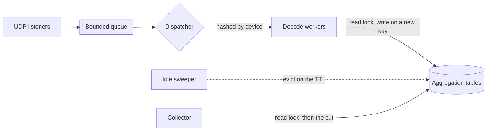

# Architecture

This document preserves the foundational design and architectural principles of the xflow-exporter.

## Scrape Path

Every scrape is served from the aggregation tables where they stand. No scrape waits on a datagram.

Ingest adds to a present entry's counters as [atomics](../internal/aggregator/table.go#L117) under the table's read lock, which is the lock a scrape takes as well. Only [creating an entry](../internal/aggregator/table.go#L139) or evicting one takes the write lock, so those are the two moments a reader waits for.

Each listener reads a whole batch per `recvmmsg` round trip on Linux and one datagram per call elsewhere. It then offers the datagram to the queue `--receiver.queue-size` bounds with a [non-blocking send](../internal/receiver/receiver.go#L207), and a listener that meets a full queue drops the datagram and counts it as `queue_full`.

One dispatcher drains that queue and hands each datagram to the shard of the worker its source address [hashes to](../internal/server/lifecycle.go#L404), which keeps one device's records in arrival order. That hand-off blocks on a shard [64 datagrams deep](../internal/server/lifecycle.go#L375), so a worker falling behind stops the dispatcher and the shared queue then drops for every device on the listener rather than for the slow one alone.

## Endpoints

The exporter serves `/metrics`, `/entries`, `/healthz`, `/-/reload` and a landing page at `/`. None of them authenticates – [`SECURITY.md`](../SECURITY.md) specifies the network path they belong on.

| Path        | Methods   | Status             | Behavior                                   |
| :---------- | :-------- | :----------------- | :----------------------------------------- |
| `/metrics`  | Any       | 200, 503           | 503 past ten concurrent gathers            |
| `/entries`  | GET       | 200, 400, 405, 503 | 400 names the values, 503 past one listing |
| `/healthz`  | Any       | 200                | Static `OK`, reading no state              |
| `/-/reload` | POST, PUT | 200, 405, 500      | 405 sets `Allow`, 500 names the error      |
| `/`         | Any       | 200                | Catch-all landing page, never 404          |

The `/` route matches every unclaimed path, so an unknown one returns the landing page. A flag left unset leaves its route unregistered, so a disabled `/entries` and a misspelled path answer alike.

The `/healthz` endpoint returns a static 200 without reading the registry or the tables. That makes it a liveness probe and never a readiness one, because a push protocol offers no arrival an endpoint could wait for.

The `/metrics` handler admits [ten concurrent gathers](../internal/server/server.go#L56) and answers the eleventh with 503. Every route carries a [60-second write deadline](../internal/server/server.go#L21) and a 30-second header timeout. The `/entries` body is the largest the process writes, so that route [restarts the deadline](../internal/server/entries.go#L73) at its own body and frees its slot rather than waiting on a disconnect.

## Absence

A device omits a field its template never declared. Absence on the wire is not a reading, and publishing `0` for it invents one.

A dimension no record carried opens no entry and publishes no series, never `0`, `false`, `NaN` or an epoch instant, save a key label's `0`, which [Collectors](collectors.md#labels) defines. An aggregated cache feeds `xflow_exporter_*` alone for the same reason, because every other family would re-count traffic the device's main cache already reported.

The counts follow that rule per family. An entry [latches](../internal/aggregator/table.go#L42) on the first record that kept its byte or packet total in unread elements, or carried none, and [withholds that family](../internal/collector/flows.go#L89) from then on, a partial sum reading exactly like a complete one. The latch never clears, because an entry whose sum lost a contribution stays short however many complete records follow.

Eviction is the push model's spelling of absence. A conversation nobody has seen for `--aggregation.entry-ttl` is not a zero, it is gone, and its series goes with it. Instants and rates are read at decode rather than at scrape, so a series carries what the device reported and not what Prometheus asked for.

## Decoder

A template cache holds every NetFlow v9 and IPFIX layout, keyed on [the exporter address, the protocol and the observation domain](../internal/decoder/templates.go#L103) and then on [the source port](../internal/decoder/templates.go#L116). The port names the transport session RFC 7011 scopes a template to, so two export processes numbering one ID under one domain keep their layouts apart. The protocol joins the key because three decoders share this store, each numbering its templates from 256 in a space of its own.

A v9 Source ID, an IPFIX Observation Domain ID and an sFlow sub-agent id are unrelated numbers that collide freely. A device exporting two protocols from one address would otherwise decode a data set against whichever protocol announced the id last. That miss is silent, because the record walks to a length the fields agree on and reaches the aggregator as a measurement.

sFlow ships sampled packet headers rather than flow state, so each readable record decodes into one single-packet record the sample's own rate then scales. A packet section is [kept until every field is read](../internal/decoder/fields.go#L93), so a device's own parsed fields win over the header the exporter would otherwise walk.

## Sampling Correction

The decoder forms the product and stores it, so every table holds corrected volumes and no consumer re-applies a rate. A record carrying no rate multiplies by one, and both products [saturate rather than wrap](../internal/flow/flow.go#L224), because a counter handed a reading below the one before it reads as a reset.

The rate comes from a v5 header, an options declaration or an sFlow sample's own field. An sFlow rate rides its sample and reaches no health series, while the decoder tracks a v9 or IPFIX declaration per domain and publishes it.

[Correction precedence](health.md#technical-notes) carries the order a record resolves in, and `xflow_sampling_unresolved_flows_total` counts the records reaching its end with nothing to apply.

## Counter Semantics

An entry's counters start at its creation and end at its eviction, and its series ends with it. Prometheus marks a series absent from the next scrape stale, so the entry's next incarnation reads as a new series rather than as a counter that fell. Flow counts are the figures the records reported and take no sampling correction.

The `other` series carries the keys `--aggregation.max-entries` refused at ingest, and nothing else. An evicted entry is not folded into it: its bytes already reached Prometheus as increments on its own series. Publishing that lifetime a second time would make `sum(rate())` over the family read double.

The [Top-K and min-bytes cuts](../internal/collector/flows.go#L531) withhold the tail below them rather than folding it, for the same reason. Its entries are still accumulating, so summing them per scrape would make a counter that falls whenever the sweep evicts one or one grows into the cut. The cut orders entries the byte counts cannot separate by age, because at one in N a tie group straddling the cut would otherwise churn the series set on every scrape.

## Bounded State

Every map keyed by wire data takes a bound, because a push protocol cannot choose its senders.

| Bounded                                      | Limit                                         | Action at the limit                              |
| :------------------------------------------- | :-------------------------------------------- | :----------------------------------------------- |
| Observation domains per device               | [256](../internal/decoder/templates.go#L44)   | Discard the record; v5 and v8 lose sequence      |
| Devices holding domain state                 | [65536](../internal/decoder/stats.go#L29)     | Discard the datagram; v5 and v8 lose sequence    |
| Templates per domain                         | [8192](../internal/decoder/templates.go#L19)  | Prune expired, then reject as `invalid_template` |
| Template fields per device                   | [65536](../internal/decoder/templates.go#L25) | Prune the domain's expired, then reject          |
| Samplers per domain                          | [4096](../internal/decoder/templates.go#L30)  | Prune idle, then leave the sampler untracked     |
| Transport sessions per domain                | [16](../internal/decoder/templates.go#L51)    | Leave that session's sequence unfollowed         |
| Sampler declarations per device and protocol | [256](../internal/decoder/templates.go#L56)   | Refuse; records take the device's own rate       |
| Interned vendor strings                      | [65536](../internal/decoder/apps.go#L173)     | Copy per occurrence rather than refuse           |
| One vendor string                            | [255 B](../internal/decoder/apps.go#L180)     | Refuse like invalid UTF-8, once per field        |
| Announced applications per device            | [16384](../internal/decoder/apps.go#L38)      | Leave the application numbered, never named      |
| Devices with decode statistics               | [65536](../internal/decoder/stats.go#L29)     | Decode on, but publish no decode counters        |
| AS names cached from the database            | [65536](../internal/enrich/mmdb.go#L86)       | Leave the AS unnamed; a join finds no name       |

A device reporting both observation points of one path keys each conversation twice, so the aggregation entry bound covers roughly half as many of them. A device reporting one point, or none, is unaffected.

The six `_refused_total` counters rise per attempt rather than per entity, so one flooding sender moves them faster than the state it failed to open. The application bounds hold ten times a standard NBAR2 pack, `--aggregation.max-entries` bounds the aggregation tables, and their bucket cap and the device budget bound the two histograms.

Idle domains, templates, sampler declarations and application tables expire on `--parser.template-ttl` in a sweep, while the sweep reclaims a device only once the fleet reaches its budget. A refused device keeps decoding and feeding the aggregation tables, losing its decode counters and timestamps alone.

The two domain budgets bound a product: a full fleet holds 256 domains per device. The template bounds multiply the same way, so the field budget is what caps one device's templates, at about 8 MiB when every template carries one field. A redefinition that budget refuses counts `invalid_template` and withdraws the layout its ID held, so the ID's data counts `missing_template` rather than decoding against the old layout.

## Dashboards

The bundled dashboard joins a traffic family onto an `_info` series to recover a readable name. Every `_info` series is keyed by a single label, `xflow_asn_info` by `asn` and `xflow_vlan_info` by `vlan`, while the family carrying the traffic keys on a pair. A join on the bare label therefore matches nothing, and `label_replace` has to rename one side first.

A plain `group_left` then drops every row the `_info` series has no entry for, because a multiplication keeps only the matched side. The bundled panels pair each join with an `unless on (...)` fallback that labels those rows from the number itself. An AS the database cannot name therefore still ranks, rather than disappearing from the panel.

Two row classes never match a name whatever the fallback: an entry the exporter keyed `0` because the device reported no value, and the `other` fold, which names no entity at all. Filter both out of a ranking panel with `exporter_address!="other"` and a `!="0"` matcher on the keyed label, or they outrank the traffic the panel is for.
