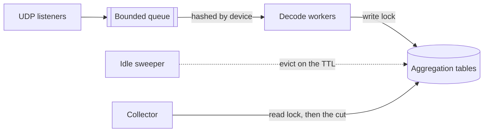

# Architecture

This document preserves the foundational design and architectural principles of the xflow-exporter.

## Push and Pull

The system employs a non-blocking scrape architecture utilizing lock-based concurrency control on aggregation tables. This decouples query responses from high-velocity ingest rates. Traditional liveness probes are omitted by design since push-based protocols inherently lack pollable endpoints.

The receive pipeline is strictly bounded by configurable threshold flags. The ingestion layer optimizes batching via `recvmmsg` on Linux, falling back to sequential reads on other kernels. The bounded ingestion queue routes datagrams to specific decode workers via source address hashing, ensuring lock-free arrival ordering per device.

## Decoder

The parsing engine maintains a stateful template cache for NetFlow v9 and IPFIX records. This cache is strictly partitioned by a composite key comprising the exporter address, protocol, and Observation Domain ID. This isolation prevents structural collisions when edge devices reuse template IDs across multiple internal domains.

Records transporting sampled packet headers bypass standard field extraction. They are delegated to a dedicated sFlow header walk routine. Strict precedence rules govern element decoding and padding ambiguity resolution, ensuring deterministic parsing outcomes.

## Endpoints

Every route binds to the address configured via `--web.listen-address` and `--web.listen-port`, and none of them authenticates — [`SECURITY.md`](../SECURITY.md) specifies the network path they belong on.

| Path        | Methods   | Status             | Behaviour                                  |
| :---------- | :-------- | :----------------- | :----------------------------------------- |
| `/metrics`  | Any       | 200, 503           | 503 past ten concurrent gathers            |
| `/entries`  | GET       | 200, 400, 405, 503 | 400 names the values, 503 past one listing |
| `/healthz`  | Any       | 200                | Static `OK`, reading no state              |
| `/-/reload` | POST, PUT | 200, 405, 500      | 405 sets `Allow`, 500 names the error      |
| `/`         | Any       | 200                | Catch-all landing page, never 404          |

The HTTP server binds a unified listener for all internal routes without authentication layers. Unregistered paths act as a catch-all, returning HTTP 200 to prevent scanner enumeration. Disabling an endpoint flag leaves that route unregistered, securely falling back to this default behavior.

The `/metrics` endpoint enforces a hard concurrency limit of 10 to bound memory consumption during in-flight serialization. Slower scrapes are forcefully terminated upon reaching a 30-second header timeout, the 60-second write deadline every route carries, or a 5-second graceful shutdown drain. This strictly bounds process lingering and exhaustion attacks.

The `/entries` endpoint admits one listing at a time and restarts that deadline at its own body, the largest the process writes, so a client that stops reading releases the slot on the deadline rather than on disconnect.

## Counter Semantics

The aggregation model utilizes ephemeral counters that accumulate from entry creation and reset upon eviction. Prometheus staleness markers demarcate these lifecycles, ensuring `rate()` calculations gracefully handle metric reincarnation. Flow counts reflect raw device exports and are deliberately decoupled from sampling correction logic.

The engine segregates capacity-induced ingest rejections into an isolated `other` fold. Evicted entries and dynamically shifting Top-K tails are intentionally excluded from this fold. This isolation prevents duplicate volume aggregation and safeguards the mathematical integrity of `sum(rate())` operations.

## Sampling Correction

The engine computes sampling-corrected volumes proactively during decoding and stores the resulting products. Operands exceeding `uint64` capacities are clamped rather than wrapped, explicitly preventing false counter resets. Correction precedence strictly follows a deterministic protocol matrix.

Correction factors are dynamically sourced from v5 headers, options templates, or inline samples. Inline rates travel statelessly with the payload and produce no audit trails. Conversely, complex domain sampling rates are persistently tracked and exposed via dedicated health metrics for observability.

## Bounded State

Every map keyed by wire data takes a bound, because a push protocol cannot choose its senders.

| Bounded                           | Limit                                        | Action at the limit                              |
| :-------------------------------- | :------------------------------------------- | :----------------------------------------------- |
| Observation domains per device    | [256](../internal/decoder/templates.go#L37)  | Discard the record; v5 and v8 lose sequence      |
| Devices holding domain state      | [65536](../internal/decoder/stats.go#L29)    | Discard the datagram; v5 and v8 lose sequence    |
| Templates per domain              | [8192](../internal/decoder/templates.go#L18) | Prune expired, then reject as `invalid_template` |
| Samplers per domain               | [4096](../internal/decoder/templates.go#L23) | Prune idle, then leave the sampler untracked     |
| Transport sessions per domain     | [16](../internal/decoder/templates.go#L44)   | Leave that session's sequence unfollowed         |
| Sampler declarations per device   | [256](../internal/decoder/templates.go#L49)  | Refuse; records take the device's own rate       |
| Interned vendor strings           | [65536](../internal/decoder/apps.go#L173)    | Copy per occurrence rather than refuse           |
| One vendor string                 | [255 B](../internal/decoder/apps.go#L180)    | Refuse like invalid UTF-8, once per field        |
| Announced applications per device | [16384](../internal/decoder/apps.go#L38)     | Leave the application numbered, never named      |
| Devices with decode statistics    | [65536](../internal/decoder/stats.go#L29)    | Decode on, but publish no decode counters        |
| AS names cached from the database | [65536](../internal/enrich/mmdb.go#L86)      | Leave the AS unnamed; a join finds no name       |

A device reporting both observation points of one path keys each conversation twice, so the aggregation entry bound covers roughly half as many of them. A device reporting one point, or none, is unaffected.

The six `_refused_total` counters track attempts rather than entities, acting as capacity saturation indicators. Application bounds safely accommodate ten times the capacity of a standard NBAR2 pack. Aggregation tables are bounded by `--aggregation.max-entries`, histograms by their bucket cap and the device budget.

Memory reclamation operates asynchronously via sweeps. Idle domains, sampler declarations and application tables are garbage-collected via TTL expiry, while devices are reclaimed only upon reaching fleet budgets. Refused devices keep decoding and feeding aggregation tables, losing their decode counters and timestamps alone, and the two domain budgets bound a product: a full fleet holds 256 domains per device.

## Absence

The aggregation engine strictly omits unsupplied dimensions rather than fabricating `0` or `false` values. This guarantees mathematical purity in downstream Prometheus aggregations. For example, NetFlow v8 aggregates strictly feed their respective domains, completely bypassing downstream volumetric tables.

Memory pressure is managed via temporal eviction strategies. Entries idling beyond configured TTLs are purged alongside their associated metrics series. Timestamps and rates are strictly generated at the point of decode, ensuring absolute temporal accuracy.
